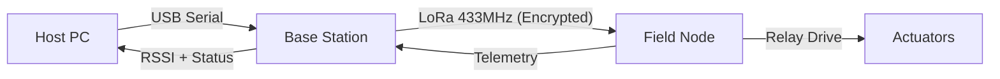

# Industrial Long-Range LoRa SCADA System

[](https://opensource.org/licenses/MIT)
[](https://www.espressif.com/en/products/socs/esp32)
[](https://www.riverbankcomputing.com/software/pyqt/)
[]()

A research-grade, secure, and bidirectional wireless SCADA (Supervisory Control and Data Acquisition) system based on the **SX1278 LoRa transceiver**. The system is designed for robust industrial relay control with multiple layers of cryptographic protection and safety interlocks.

---

## 🚀 Overview

The **Industrial LoRa SCADA System** provides a secure bridge between a centralized host and remote field actuators. It leverages LoRa's long-range capabilities while enforcing strict industrial safety standards and state-of-the-art authenticated encryption.

### Key Features
- **Authenticated Encryption:** AES-128 in Counter (CTR) mode for confidentiality and HMAC-SHA256 for integrity.
- **Anti-Replay Protection:** Monotonically increasing sequence numbers to prevent command injection attacks.
- **Safety Interlocks:** Real-time mutual-exclusion logic and emergency-stop broadcasting.
- **Timed Fallbacks:** Configurable auto-shutdown timers for fail-safe operation.
- **Modern HMI:** A professional PyQt6 dashboard with live telemetry, analytics, and CSV export.

---

## 🏗️ System Architecture

The system consists of three primary layers:

| Layer | Component | Responsibility |
| :--- | :--- | :--- |
| **Supervisory** | PyQt6 Dashboard | HMI, logging, safety configuration, and analytics. |
| **Base Station** | ESP32 + SX1278 | Encapsulation, encryption, and RF broadcasting. |
| **Field Node** | ESP32 + SX1278 | Decryption, authentication, and relay actuation. |

### Communication Flow


---

## 📂 Directory Structure

```text
.
├── firmware/
│   ├── base_station/    # ESP32 Base Station Source (TX)
│   └── field_node/      # ESP32 Field Node Source (RX)
├── dashboard/           # PyQt6 SCADA Dashboard (Python)
├── docs/                # Technical Guides & Architecture
├── hardware/            # BOM and Pinout Specifications
└── scripts/             # Utility and Analysis Scripts
```

---

## 🛠️ Installation & Setup

### Firmware (ESP32)
1.  **Libraries:** Install `LoRa` and `Crypto` (Arduino-Crypto) via the Library Manager.
2.  **Upload:** Use the Arduino IDE to upload `base_station.ino` to the transmitter and `field_node.ino` to the receiver.
3.  **Frequency:** Default is 433 MHz. Adjust in `LoRa.begin()` if necessary.

### Dashboard (Python)
1.  **Dependencies:**
    ```bash
    pip install PyQt6 pyserial
    ```
2.  **Run:**
    ```bash
    python dashboard/main.py
    ```

---

## 🛡️ Safety Mechanisms

| Mechanism | Description |
| :--- | :--- |
| **Mutual Exclusion** | Prevents conflicting relay states (e.g., Forward/Reverse simultaneously). |
| **Timed Fallback** | Automatically de-energizes relays after a user-defined timeout. |
| **Emergency Stop** | A global broadcast that forces all field nodes into a safe (OFF) state. |
| **Anti-Replay** | Packets with duplicate or older sequence numbers are discarded. |

---

## 👥 Team
- **Syed Umar Ali** (Team Leader)
- **Syeda Noor Fatima**
- **Ayesha Lakho**
- **Abdul Basit**
- **Abdul Moiz**

---

## ⚖️ License
Distributed under the MIT License. See `LICENSE` for more information.
